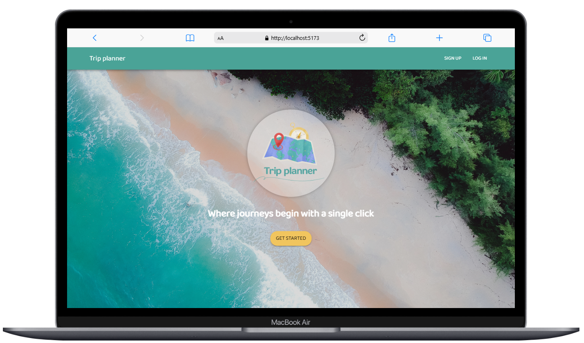
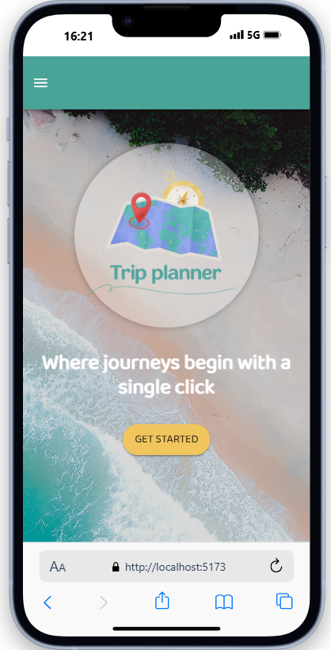

# Trip Planner Web App

[](https://github.com/lrasata/trip-planner-web-app/actions/workflows/trip-planner-ci.yml)


Trip Planner is a web app built for organizing travel plans such as flights, stays, activities, notes,
and maps. It supports real-time collaboration, budget tracking, and personal touches like photos.

This project serves as the frontend counterpart to the [Trip Planner API](https://github.com/lrasata/tripPlannerAPI). It is built with React, TypeScript, and
Vite, and it is designed to provide users with an intuitive interface.

## Purpose

_The Story Behind Trip Planner_

I love to travel and even more than that, I love organizing travel. For me, it feels like a MUST, because I want to
make the best out of a trip, I have got some homework to do. Planning gives me almost as much excitement as the trip
itself. But until recently, planning a trip meant writing things down all over my computer : in notes apps, random
document, my calendar and my email box.

I always knew there has to be a better way but when I tried different travel apps, but none of them felt right.
They were either too complicated, too limited, or just not made for the way I think.

So I decided to build my own. Something clean, flexible, and genuinely useful.



## Features

- Itinerary builder :bulb:
- Budget tracking :bulb:
- Collaborative planning (comments, task assignments)
- Personalization (cover photo, trip notes)
- Map and timeline views
- Modular architecture for adding future features easily

## Dev perspective

Trip Planner is not only a practical tool. Since there are countless features that could be added from weather integration,
AI-powered suggestions, local event feeds, to journals, all that makes this personal project exciting and expandable for full-stack experimentation.

## Tech Stack

- **Frontend**: React, TypeScript, Emotion CSS, MUI

  - **Framework**: React 18
  - **Language**: TypeScript
  - **Build Tool**: Vite
  - **UI Library**: Material-UI (MUI)
  - **Package Manager**: npm

- **Backend**: Java Spring Boot (REST API)

## Why React as framework for the frontend

I chose React for the frontend first and foremost because this is the technology I have most experience with.
But also because it offers a powerful combination of flexibility, component-based structure, and strong community
support making it ideal for building dynamic, interactive web apps like Trip Planner.

_Component-Based Architecture:_ React’s reusable components are perfect for building a modular UI which fits the
design of a trip planner with repeating elements such as itinerary items or trip cards.

_Rich Ecosystem & Libraries:_ React integrates easily with modern tools like TypeScript, Emotion CSS, and MUI.
This let me move quickly with styled components, responsive design, and prebuilt UI elements and keep full control over
customization.

_Declarative UI:_ With React’s declarative approach, I can easily manage complex UI states.

_Scalability & Maintainability:_ This project is designed to grow, and React makes it easy to scale features,
split views into smaller components, and maintain a clean structure as the app gets bigger.

_Strong Dev Tools & Ecosystem:_ React’s dev tools, community packages, and support in modern deployment platforms make development and debugging faster and more enjoyable.


## Getting Started - Run locally

### Prerequisites

- **Node.js**: Version 16 or higher
- **npm**: Version 7 or higher

### Installation

1. **Clone the repository:**

   ```bash
   git clone https://github.com/lrasata/trip-planner-web-app.git
   cd trip-planner-web-app
   ```

2. **Install dependencies:**

   ```bash
   npm install
   ```

3. **Set environment variables:**

   ```text
   VITE_API_URL=http://localhost:8080
   VITE_API_LOCATIONS=https://<api-id>.execute-api.<aws-region>.amazonaws.com/prod/locations
   ```

4. **Start the development server:**

   ```bash
   npm run dev
   ```

   The application will be accessible at `http://localhost:5173`.

## Available Scripts

- **Start Development Server:**

  ```bash
  npm run dev
  ```

- **Build for Production:**

  ```bash
  npm run build
  ```

- **Preview Production Build:**

  ```bash
  npm run preview
  ```

- **Formatting:**

  ```bash
  npm run format
  ```


## Docker

You can containerize the Trip Planner frontend app using Docker and manage multi-container setups with Docker Compose.

### Using Docker Compose

```bash
docker-compose up --build
```

This will build and start services in `docker-compose.yml`. In this file, the web app is set up to be accessible on port `5173` : `http://localhost:5173/`

Make sure Docker is installed and running on your system.

## E2E Testing with Cypress

**Open Cypress Test Runner (interactive)**

```bash
npm run cy:open
```

This opens the Cypress UI where you can run tests interactively, watch them run, and debug.

**Run Cypress Tests in Headless Mode (CI / automated)**

```bash
npm run cy:run
```

This runs all the Cypress tests in headless mode and outputs the results in the terminal.

## License

This project is licensed under the MIT License.
